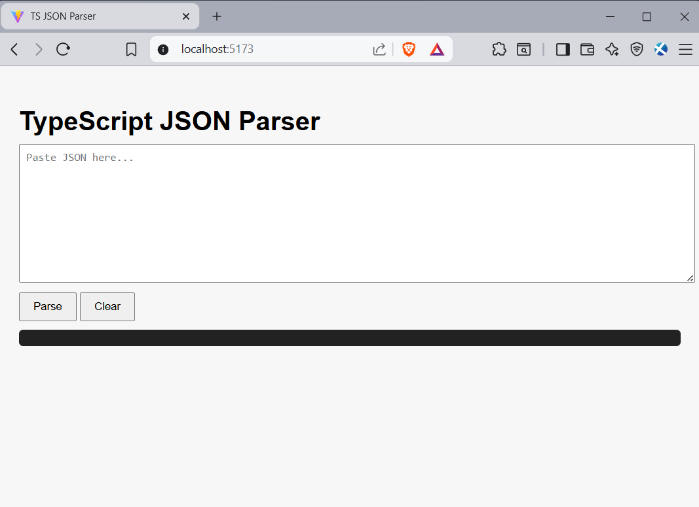
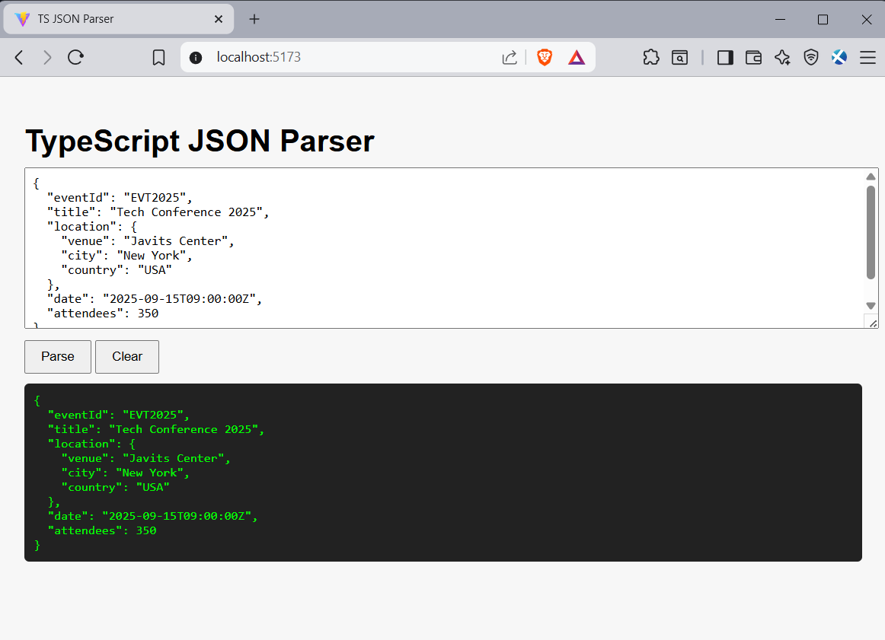
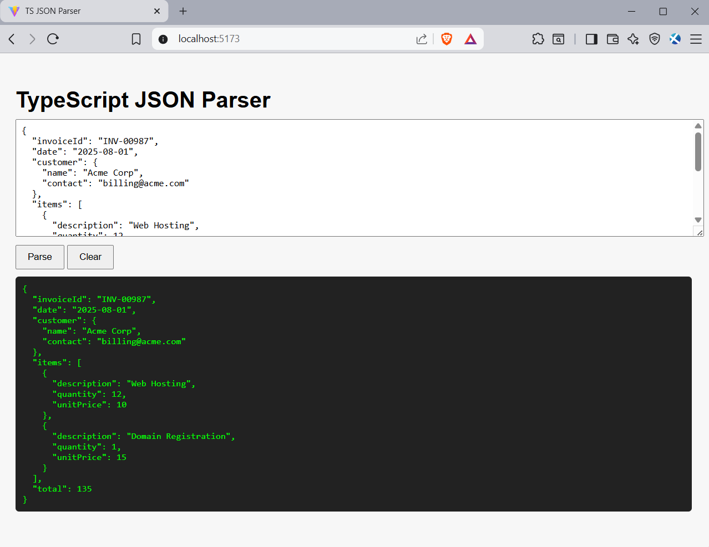
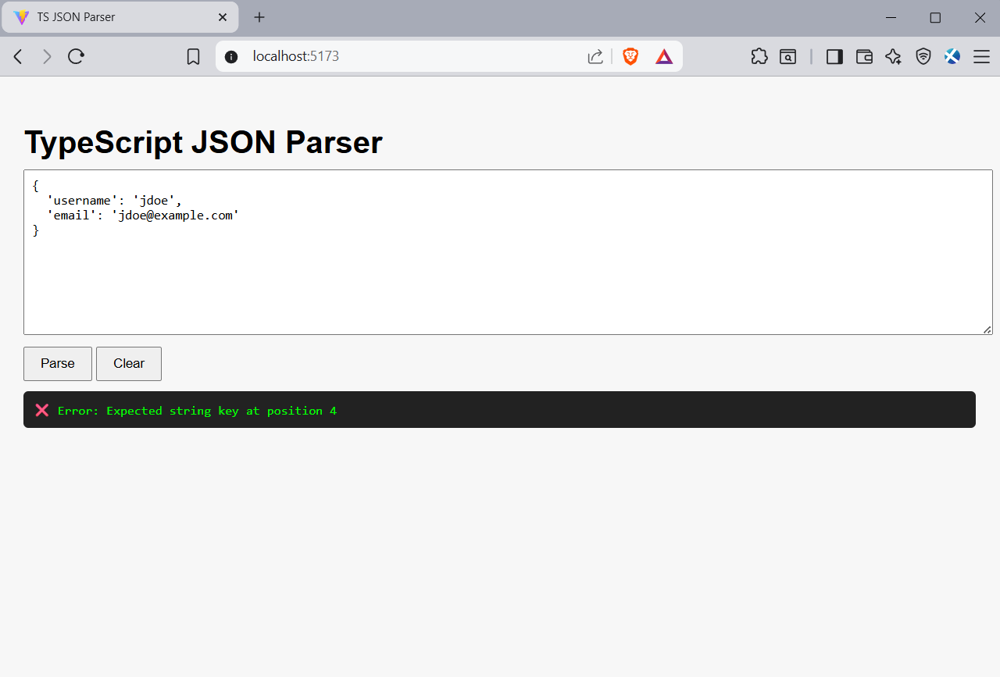
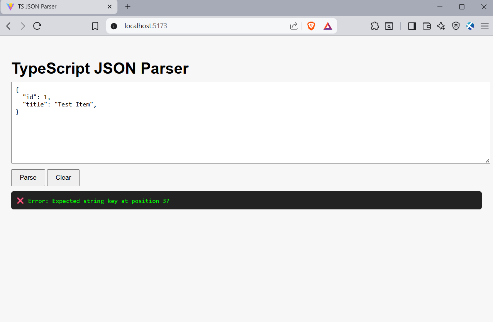

# TypeScript JSON Parser 📝

A lightweight, browser-based JSON parser implemented in TypeScript. This tool allows you to paste JSON input, parse it, and see formatted output instantly. It handles objects, arrays, strings, numbers, booleans, and null values, with full error detection for invalid JSON.

---

## 🔧 Features

- **⚡ Interactive Parsing**
  - Paste JSON input into a textarea
  - Click Parse to see formatted output
  - Full error messages for invalid JSON

- **🧹 Clear / Reset**
  - Easily clear the input and output with a single button

- **📄 JSON Support**
  - Fully supports objects {}, arrays [], strings, numbers, booleans, and null
  - Handles nested structures and escape sequences
  - Compliant with RFC 7159 JSON specification

- **🎨 Simple, Clean UI**
  - Minimal browser interface
  - Output is pretty-printed for easy reading

---

## 📂 Directory Structure

```
ts-json-parser/
├── src/
│   ├── jsonParser.ts       // Core TypeScript JSON parser
│   ├── main.ts             // Browser UI with Parse and Clear buttons
│   └── style.css           // CSS styling
├── index.html              // Entry HTML file
├── package.json
└── README.md
```

---

## 🛠️ Run Locally

### 1. Install dependencies
```bash
npm install
```

### 2. Start development server
```bash
npm run dev
```

### 3. Open the browser
http://localhost:5173/

---

## 💻 Screenshots

### Main UI



### Parsed Output




### Error Handling




---

## 📄 License

This project is licensed under the [MIT License](https://opensource.org/licenses/MIT).